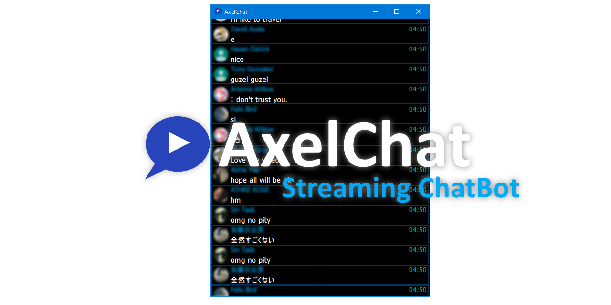
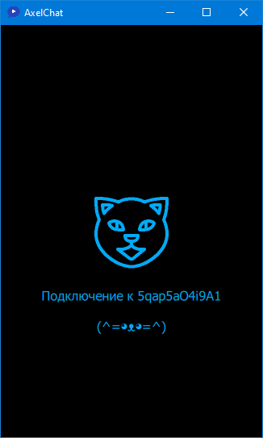
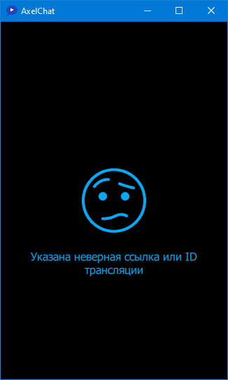
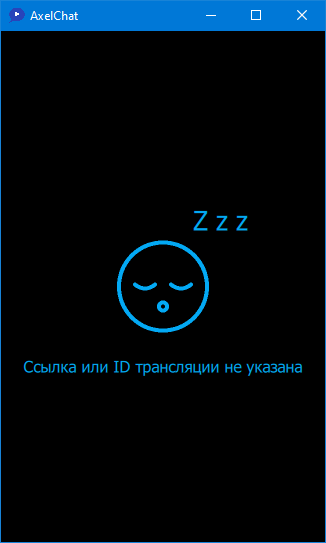
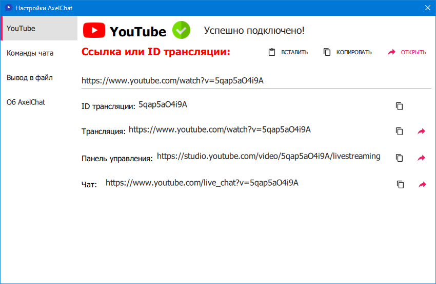
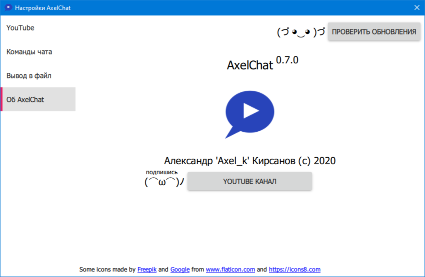

# AxelChat
A program for adding interactivity to live broadcasts and communication with viewers

<p align="center">
  
</p>

<b><a href="/../../releases">Download</a></b>

# Screenshots
<p align="center">
  
  
  
  
  
  
  
</p>

# Building
## Setting Up the Environment for Windows 7 and newer, x64
1. Install Visual Studio Community 2019: https://visualstudio.microsoft.com
  <br> 1.1 In Visual Studio Installer enable "Development of classic C ++ applications" component
  <br> 1.2 In tab "Language Packs" enable only English beacuse there may be encoding problems in displaying compiler messages when in other languages
  <br> 1.3 After installation, you do not need to run Visual Studio
2. Download Open Source Qt online installer (sign-up or login required during installing): https://www.qt.io/download-qt-installer or you can also find the offline installers (you need Qt 5.15.x or 5.12.x for x86_64 MSVC2019): https://www.qt.io/offline-installers
3. Run Qt installer
4. For online-installer you need sign-up or login in installer window
5. For online-installer:
  <br> 5.1. In page ```Qt Open Source Usage Obligations``` enable checkbox ```I have read and approve the obligations of using Open Source Qt```
  <br> 5.2. In page ```Selection of Components``` you need enabled components:
    * Qt / Qt 5.15.x / MSVC 2019 64-bit
    * Developer and Designer Tools / Qt Creator x.x.x CDB Debugger Support
    * Developer and Designer Tools / Debugging Tools for Windows
    * Developer and Designer Tools / OpenSSL 1.1.1x Toolkit / OpenSSL 32-bit binaries
    * Developer and Designer Tools / OpenSSL 1.1.1x Toolkit / OpenSSL 64-bit binaries
## Build source
1. Clone repo or download source
2. Open file ```<AxelChat_project_folder>/src/AxelChat.pro``` with Qt Creator
3. Select Desktop ```Qt 5.x.x MSVC2019```
4. Select ```Release``` building mode
5. Click button ```Build Project "AxelChat:```. If successful build, folder ```release_win64``` will appear in the project folder with AxelChat.exe and other files
6. Unpack ```<AxelChat_project_folder>/app_files/windows_x86_64_msvc``` in ```<AxelChat_project_folder>/release_win64``` without rewriting
7. Run ```<AxelChat_project_folder>/release_win64/AxelChat.exe``` or click ```Run``` in Qt Creator
8. For subsequent builds, just close ```AxelChat.exe``` application and click ```Run``` in Qt Creator
9. To release an AxelChat for use by other users, check if all the required DLLs (*.os for Linux) are in the folder. https://github.com/3dproger/ProcDepMonitor or https://www.dependencywalker.com/ or analogs can helps you
