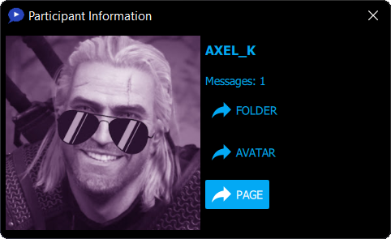

[Download](https://github.com/3dproger/axelchat/releases/latest/) |
[Releases](https://github.com/3dproger/AxelChat/releases) |
[Issues](https://github.com/3dproger/AxelChat/issues) |
[Patreon](https://patreon.com/axel_k)

  

# Features
- Display messages from multiple streaming platforms at once. For example YouTube and Twitch
- Display messages from any live YouTube chat without authorization. Messages in AxelChat arrive much faster than the standard YouTube live chat in your browser
- Display messages from any live Twitch chat with avatars of participants
- Displaying the number of viewers both total and for individual platforms
- Displays detailed information about a participant in a live chat in a separate window (including a link to the participant's channel)

  

- Sound commands that are activated by the corresponding message from the chat. There are built-in commands, but you can always add your own
- Saving messages and other information on the fly to text files. It may be useful for further processing by other software
- Proxy support (experimental)
- Link display for quick and easy broadcast management

# Possibly in future updates
- Support for other live streaming platforms
- Support for donate platforms
- Support for other operating systems, including mobile
- Many other improvements
# FAQ
- Is AxelChat considered a viewer? - No, at least for now, for YouTube and Twitch
- Whether AxelChat sends any user data? - No, except for what is required for authorization on Twitch
- Does AxelChat work with YouTube premieres? - Yes
- Can I download a YouTube chat for an already past stream using the AxelChat? - No, use something else instead. For example, use the browser extension [Save Live Streaming Chats for YouTube™](https://chrome.google.com/webstore/detail/save-live-streaming-chats/bcclhcedlelimlnmcpfeiabljbpahnef)
- Is the source code hidden? - Yes. Until recently, the source code was open, but I hid it due to the reluctance to leak my "company secrets" to potential competitors. I do not exclude that someday I will open the source code again
# Known Issues
- YouTube: messages that YouTube may find inappropriate are not displayed
- YouTube: works only with open access broadcasts or available via the link. Private broadcasts are not supported
- YouTube: Doesn't work for streams with age and possibly other restrictions
# Troubleshooting
### Doesn't connect (General)
- Check your internet connection
- Check proxy settings if using
- Check your firewall settings
### Doesn't connect (YouTube)
- Check that the link to the broadcast is correct
- Check that the broadcast is incomplete
- Check that the broadcast is publicly available or accessed via a link. Private broadcasts are not supported
### Doesn't connect (Twitch)
- Check that the link to the channel is correct
- Check that the OAuth-token is correct. Update the OAuth-token, if necessary, by pressing the corresponding button in the AxelChat
- Check in the settings of your Twitch account if the permission to use the twitch account has not been revoked. Update the OAuth-token, if necessary, by pressing the corresponding button in the AxelChat
