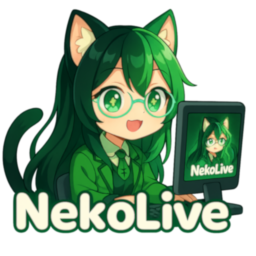

# AxelChat
                                  

AxelChat is an application that combines chats from various streaming and other platforms and displays them in one window or in a widget for OBS or even on the smartphone screen. It supports a large number of platforms, has a user-friendly interface and many useful features

[Download](https://github.com/3dproger/axelchat/releases/latest/) |
[Releases](https://github.com/3dproger/AxelChat/releases) |
[Feedback](https://docs.google.com/forms/d/e/1FAIpQLSeWahZ2AiyrPNtoF7LLrs3hO4ylYJmth4PmNvjSGsDxiwuwZg/viewform?usp=sf_link) |
[Issues](https://github.com/3dproger/AxelChat/issues) |
[Privacy Policy](https://3dproger.github.io/AxelChat/privacy) |
[EULA](https://3dproger.github.io/AxelChat/eula) |
[Data Deletion](https://3dproger.github.io/AxelChat/data-deletion) |
[Documentation](https://3dproger.github.io/AxelChat/docs) |
[Tutorials and discussions](https://github.com/3dproger/AxelChat/discussions) |
[Custom styles](https://github.com/3dproger/AxelChat/discussions/621) |
[Telegram](https://t.me/axelchatstreaming) |
[Donate](https://3dproger.github.io/AxelChat/sponsor)

  

### In OBS

  

### On smartphone

  

### Chat participants

  

### Connection settings

  

### Common settings

  

# Features
- [x] Display messages from multiple streaming platforms at once
- [x] Display avatars of participants of chat
- [x] Displaying the number of viewers both total and for individual platforms
- [x] Displays detailed information about a participant in a live chat in a separate window including a link to the participant's page/channel (see example below)
- [x] Sound commands that are activated by the corresponding message from the chat. There are built-in commands, but you can always add your own
- [x] Saving messages and other information on the fly to text files. It may be useful for further processing by other software
- [x] BetterTTV, FrankerFaceZ, 7TV emotes support on any streaming platform
- [x] Ability to integrate with other applications via WebSocket
- [x] Ability to integrate with other applications via file system
- [x] Web-based widgets
- [x] Displaying chat on your smartphone and other devices in your local network
- [x] API for integration with your applications
- [x] Styles for widgets
- [ ] Appearance editor for Web-based widgets
- [ ] Many other improvements

# Supported platforms
- [x] Twitch
- [x] YouTube
- [x] Kick
- [x] Trovo
- [x] TikTok
- [x] Rumble
- [x] Loco
- [x] CHZZK (치지직)
- [x] DLive
- [x] Steam
- [x] Facebook
- [x] GoodGame
- [x] VK Video Live
- [x] VK Video
- [x] OK
- [x] Rutube
- [x] Parti
- [x] Odysee
- [x] Niconico Live (ニコニコ生放送)
- [x] Picarto
- [x] Vaughn Live
- [x] Livacha
- [x] NekoLive
- [x] Telegram
- [x] Discord
- [x] DonationAlerts
- [x] Meme Alerts
- [x] donate.stream
- [x] DonatePay
- [x] BetterTTV
- [x] FrankerFaceZ
- [x] 7TV

# Platforms that are not yet supported
- [ ] SOOP
- [ ] Icecast
- [ ] Bigo Live
- [ ] X / Twitter
- [ ] RobotStreamer
- [ ] MakerTube
- [ ] FC2 Live
- [ ] shareplay.tv
- [ ] Rooter
- [ ] Nimo TV
- [ ] Huya Live
- [ ] Douyin
- [ ] StreamElements
- [ ] Streamlabs
- [ ] Patreon
- [ ] Boosty
- [ ] Chatterino Homies Edition
- [ ] Many others. **You can suggest [here](https://docs.google.com/forms/d/e/1FAIpQLSeWahZ2AiyrPNtoF7LLrs3hO4ylYJmth4PmNvjSGsDxiwuwZg/viewform) or [here](https://github.com/3dproger/AxelChat/issues)**

# FAQ
- Is AxelChat Open Source? - Partially yes. AxelChat widgets are open source, see: https://github.com/3dproger/AxelChatWidgets. Also, AxelChat has an API that will allow you to create your own software integrated with AxelChat, see [docs](https://3dproger.github.io/AxelChat/docs)
- I enabled Ignore Mouse and now I can't interact with AxelChat in any way and I can't disable this option. - You can open the menu via the AxelChat icon in the system tray
- [How to Add AxelChat overlay with transparent background in OBS](https://github.com/3dproger/AxelChat/discussions/589)
- [How to open the AxelChat on a smartphone or other device via a local network (Wi-Fi)](https://github.com/3dproger/AxelChat/discussions/597)
- [Autostart and how to attach AxelChat as an OBS dock](https://github.com/3dproger/AxelChat/discussions/591)
- Is AxelChat considered a viewer? - Depending on the version of AxelChat and depending on the streaming platform, this may or may not be the case. If possible, we try not to allow AxelChat to be considered a viewer
- Does AxelChat work with YouTube premieres? - Yes
- Can I download a YouTube chat for an already past stream using the AxelChat? - No, but there are many other solutions. For example, special browser extensions

# How to help develop AxelChat
- [Financial support](https://3dproger.github.io/AxelChat/sponsor)
- Recommend to your favorite streamer
- Suggest your idea in any convenient way
- You can report a bug or suggest a new feature in [Issues](https://github.com/3dproger/AxelChat/issues)
- Help with translations into other languages using the [Qt Linguist](https://doc.qt.io/qt-5/qtlinguist-index.html). I can send you translation blank files, just write to me about it
- Create and improve widgets using front-end technologies like React. Here is the official widget repository: https://github.com/3dproger/AxelChatWidgets
- Create software that can be integrated into a AxelChat using a websocket or using a file system. For example: https://github.com/3dproger/AxelChatClientGM/

# Known Issues
- YouTube: messages that YouTube may find inappropriate are not displayed
- YouTube: works only with open access broadcasts or available via the link. Private broadcasts are not supported
- YouTube: Doesn't work for streams with age and possibly other restrictions
- Telegram: avatars of users who have disabled the display of avatars in the privacy settings are not displayed

# Troubleshooting
### Doesn't connect (General)
- Check the correctness of the specified stream links/channel name
- Check your internet connection
- Try to use VPN
- Check proxy settings if using
- Check your firewall settings

### Twitch: Avatars not showing
- Check that the link to the channel is correct
- Check that the OAuth-token is correct. Update the OAuth-token, if necessary, by pressing the corresponding button in the AxelChat
- Check in the settings of your Twitch account if the permission to use the twitch account has not been revoked. Update the OAuth-token, if necessary, by pressing the corresponding button in the AxelChat

### Control panel web page does not open correctly
- Make sure you're logged into your streaming site in your default browser
- Make sure that you have specified a stream in AxelChat that belongs to your streaming platform account in the default browser, and not someone else's stream
